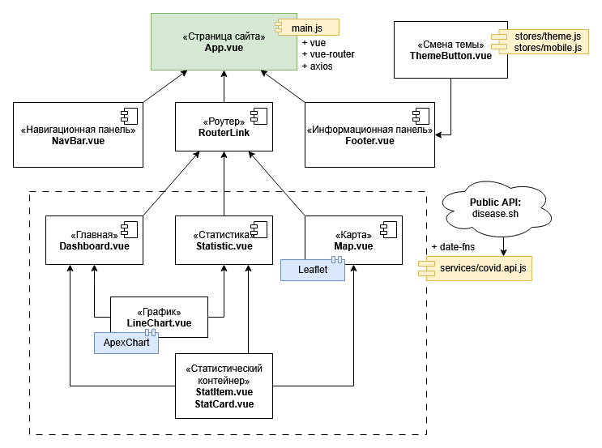

# Отчет по приложению

## Обзор проекта

Веб-приложение для визуализации статистики по COVID-19, построенное на Vue.js с использованием современных библиотек для работы с графиками и картами.

## Обзор архитектуры и кода

### Структура приложения

Приложение организовано по компонентному принципу, что обеспечивает модульность, переиспользуемость кода и простоту сопровождения:

**Главный компонент (`App.vue`)**
- Корневой компонент приложения
- Содержит навигацию (`NavBar`), футер (`Footer`) и область для отображения маршрутов (`RouterView`)
- Обеспечивает единую структуру для всех страниц

**Страницы (Views)**
- **Dashboard** - главная страница с общей статистикой
  - Использует `Banner`, `StatCard` (4 карточки), `LineChart`, `StatItem` (топ-10 стран)
  - Загружает глобальные данные, данные по странам и исторические данные за 30 дней
  - Обрабатывает данные для графика с помощью `date-fns`

- **Statistic** - детальная статистика с фильтрами
  - Позволяет выбирать конкретную страну и период (30/90/365 дней или все время)
  - Показывает дополнительную информацию о стране и статистику по континентам
  - Использует те же компоненты, что и Dashboard, но с расширенным функционалом

- **Map** - географическое представление данных
  - Интерактивная карта с маркерами по странам
  - Возможность переключения метрик (случаи, смерти, выздоровления)
  - Топ-20 стран по выбранному показателю

### Ключевые компоненты

**LineChart (`LineChart.vue`)**
- Самый сложный компонент приложения
- Интеграция с ApexCharts через `vue3-apexcharts`
- Поддержка двух режимов отображения: накопительные данные и новые случаи (производная)
- Агрегация данных по дням/неделям/месяцам для больших наборов данных
- Адаптация к темной/светлой теме
- Интерактивные инструменты (зум, панорамирование)

**StatCard (`StatCard.vue`)**
- Простой компонент для отображения статистических карточек
- Форматирование чисел с помощью `toLocaleString`
- Отображение изменений с предыдущего дня

**Другие компоненты**
- `Banner` - заголовки и описания секций
- `StatItem` - элементы списка топ-стран
- `ThemeButton` - переключатель темы
- `NavBar`, `Footer` - навигация и подвал

### Сервисы и управление состоянием

**covid.api.js**
- Централизованный модуль для работы с API disease.sh
- Использует Axios с настройкой базового URL и таймаута (25 секунд)
- Методы для получения:
  - Глобальной статистики
  - Данных по всем странам
  - Исторических данных (глобальных и по странам)
  - Статистики по континентам
  - Данных о вакцинации

**theme.js**
- Простое реактивное хранилище для управления темой
- Использует Composition API (`ref`)
- Сохранение настроек в localStorage
- Автоматическое применение темы к `document.documentElement`

### Алгоритмы и подходы

**Обработка данных в LineChart**
- Расчет производной для отображения новых случаев
- Агрегация данных по периодам для улучшения производительности
- Форматирование дат с помощью `date-fns` с русской локализацией

**Визуализация на карте**
- Нормализация данных для размера маркеров
- Цветовое кодирование по уровням (5 градаций)
- Обработка координат стран и фильтрация некорректных данных

## Использованные библиотеки и инструменты

### Основные технологии
- **Vue 3** - реактивный фреймворк с Composition API
- **Vue Router 4** - маршрутизация SPA
- **Vite** - быстрая сборка и разработка

### Библиотеки для визуализации
- **ApexCharts + vue3-apexcharts** - мощная библиотека для интерактивных графиков
  - Поддержка зума, панорамирования
  - Адаптивность и кастомизация
  - Темная/светлая тема
- **Leaflet** - легковесная библиотека для интерактивных карт
  - OpenStreetMap тайлы
  - Кастомные маркеры и попапы
  - Ограничение области просмотра

### Утилиты
- **Axios** - HTTP-клиент с промисами
- **date-fns** - современная библиотека для работы с датами
  - Русская локализация
  - Функциональный подход
  - Tree-shaking поддержка

### Архитектурные решения

1. **Компонентный подход** - разделение ответственности между компонентами
2. **Централизованное API** - один модуль для всех запросов к внешнему API
3. **Реактивное управление состоянием** - использование Vue 3 reactivity без Vuex
4. **Обработка ошибок** - try-catch блоки и отображение ошибок пользователю
5. **Производительность** - агрегация данных для больших наборов, ленивая загрузка компонентов
6. **Адаптивность** - responsive дизайн и оптимизация для мобильных устройств
